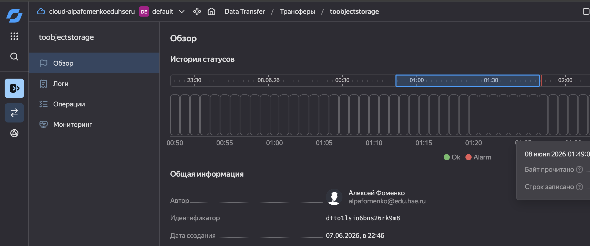

# ETL-процессы. Модуль 4 (экзамен)

**Студент:** Фоменко Алексей  
**Преподаватель:** Артём Озерков  
**Дисциплина:** ETL-процессы  
**Время выполнения:** 10 часов  

---

## Стек

`Yandex Data Processing` `Apache Airflow` `Apache Kafka` `PySpark`  
`Yandex DataTransfer` `Yandex DataLens` `Yandex Object Storage` `YDB`  
`HiveQL` `Spark SQL` `YQL` `GitHub`

---

## Задание 1. Yandex DataTransfer

### 1.1 Создание БД Yandex DataBase


### 1.2 Подготовка таблицы transactions_v2

```sql
CREATE TABLE mental_health_survey (
    participant_id                Utf8 NOT NULL,
    age                           Uint32,
    gender                        Utf8,
    country                       Utf8,
    occupation                    Utf8,
    work_hours_per_week           Uint32,
    screen_time_hours             Double,
    sleep_hours                   Double,
    sleep_quality                 Utf8,
    exercise_frequency            Utf8,
    stress_score                  Uint32,
    anxiety_score                 Uint32,
    depression_score              Uint32,
    social_support                Utf8,
    therapy_history               Bool,
    family_history_mental_illness Bool,
    academic_or_job_pressure      Uint32,
    financial_stress_score        Uint32,
    mental_health_risk            Utf8,
    survey_date                   Datetime,
    PRIMARY KEY (participant_id)
);
```


### 1.3 Создание трансфера в Object Storage



### 1.4 Проверка работоспособности


---

## Задание 2. Автоматизация через Apache Airflow

### 2.1 Подготовка инфраструктуры


### 2.2 PySpark-задание

```python
# код PySpark-задания
```


### 2.3 DAG-файл

```python
# код DAG
```


### 2.4 Результат выполнения


---

## Задание 3. Apache Kafka + PySpark

### 3.1 Архитектура


### 3.2 Чтение топика Kafka

```python
# код чтения топика
```


### 3.3 Разворачивание JSON в плоский вид

```python
# flatten JSON
```


---

## Задание 4. Визуализация в DataLens


---


