# ETL-процессы. Модуль 4 (экзамен)

**Студент:** Фоменко Алексей  
**Преподаватель:** Артём Озерков  
**Дисциплина:** ETL-процессы  
**Время выполнения:** 10 часов  

---

## Стек

`Yandex Data Processing` `Apache Airflow` `Apache Kafka` `PySpark`  
`Yandex DataTransfer` `Yandex DataLens` `Yandex Object Storage` `YDB`  
`HiveQL` `Spark SQL` `YQL` `GitHub`

---

## Задание 1. Yandex DataTransfer

### 1.1 Создание БД Yandex DataBase

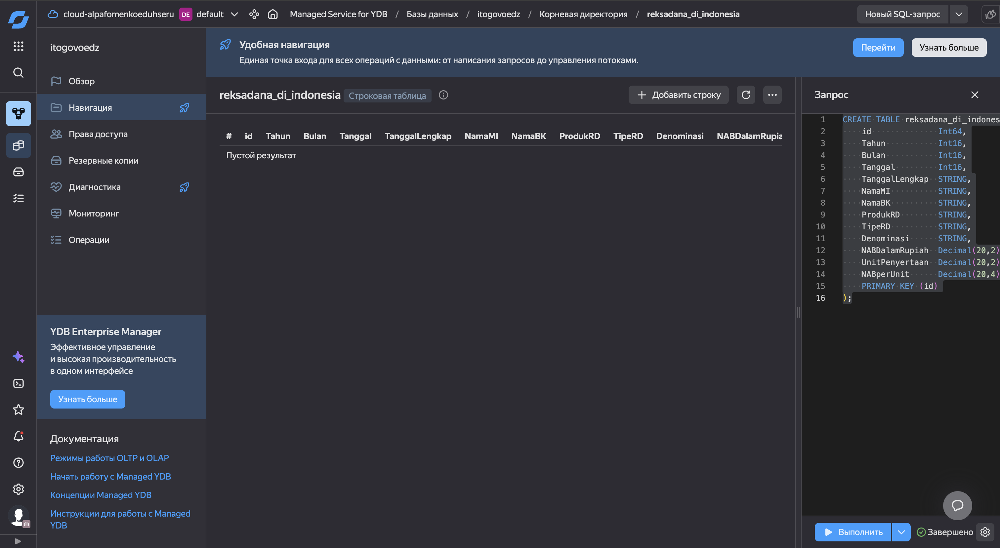

### 1.2 Подготовка таблицы transactions_v2

```sql
CREATE TABLE mental_health_survey (
    participant_id                Utf8 NOT NULL,
    age                           Uint32,
    gender                        Utf8,
    country                       Utf8,
    occupation                    Utf8,
    work_hours_per_week           Uint32,
    screen_time_hours             Double,
    sleep_hours                   Double,
    sleep_quality                 Utf8,
    exercise_frequency            Utf8,
    stress_score                  Uint32,
    anxiety_score                 Uint32,
    depression_score              Uint32,
    social_support                Utf8,
    therapy_history               Bool,
    family_history_mental_illness Bool,
    academic_or_job_pressure      Uint32,
    financial_stress_score        Uint32,
    mental_health_risk            Utf8,
    survey_date                   Datetime,
    PRIMARY KEY (participant_id)
);
```

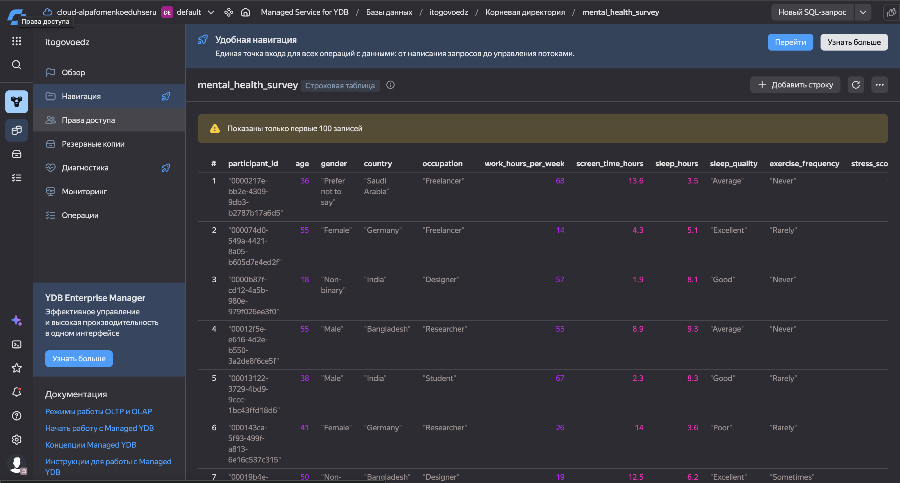

### 1.3 Создание трансфера в Object Storage

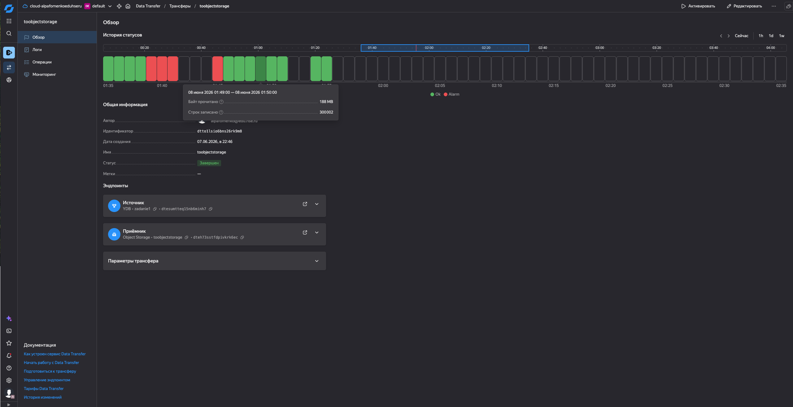

### 1.4 Проверка работоспособности

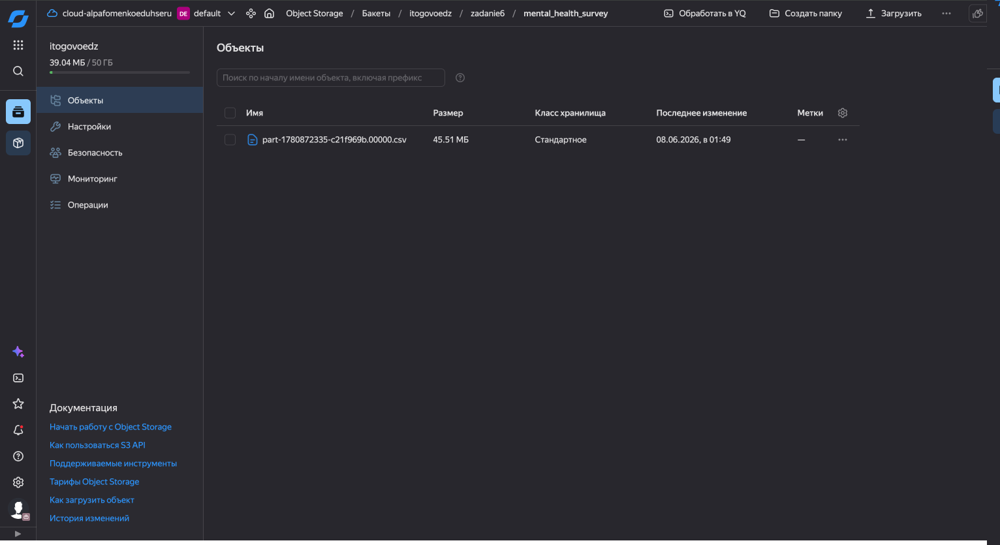

---

## Задание 2. Автоматизация через Apache Airflow

### 2.1 Подготовка инфраструктуры

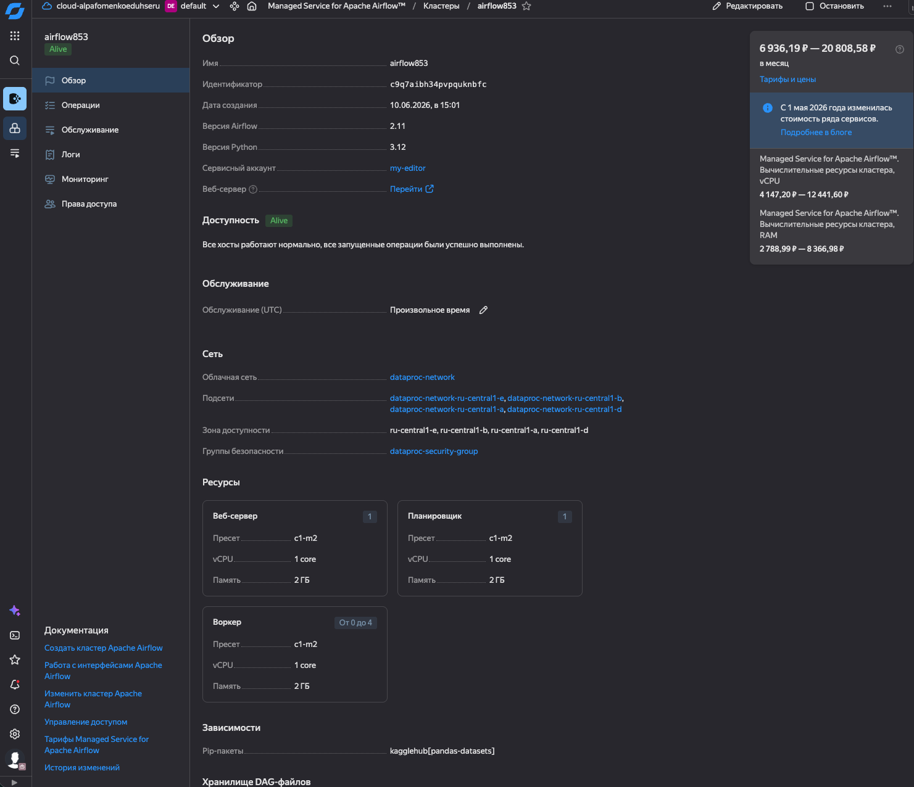

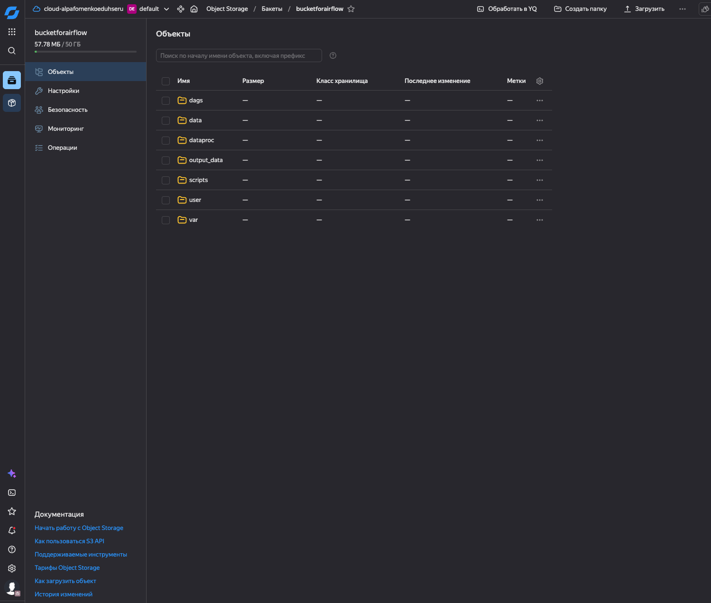
### 2.2 PySpark-задание

```python
from pyspark.sql.types import *
from pyspark.sql import SparkSession

spark = SparkSession.builder \
    .appName("create-table") \
    .enableHiveSupport() \
    .getOrCreate()

schema = StructType([
    StructField('Appid', IntegerType(), True),
    StructField('Name', StringType(), True),
    StructField('Type', StringType(), True),
    StructField('ReleaseDate', StringType(), True),
    StructField('Genres', StringType(), True),
    StructField('Developers', StringType(), True),
    StructField('Publishers', StringType(), True),
    StructField('Description', StringType(), True),
    StructField('price', StringType(), True),
    StructField('Thumbnail', StringType(), True),
])

df = spark.read \
    .option("header", "true") \
    .option("multiLine", "true") \
    .option("quote", '"') \
    .option("escape", '"') \
    .schema(schema) \
    .csv("s3a://bucketforairflow/data/steam.csv")

df.write.mode("overwrite").option("path", "s3a://bucketforairflow/BTCUSTD").saveAsTable("BTCUSTD")
```

### 2.3 DAG-файл

```python
import uuid
import datetime
from airflow import DAG
from airflow.utils.trigger_rule import TriggerRule
from airflow.providers.yandex.operators.yandexcloud_dataproc import (
    DataprocCreateClusterOperator,
    DataprocCreatePysparkJobOperator,
    DataprocDeleteClusterOperator,
)


YC_DP_AZ = 'ru-central1-b'
YC_DP_SSH_PUBLIC_KEY = 'ssh-rsa AAAAB3NzaC1yc2EAAAADAQABAAABgQC7fZqwPCYwjP9dVjC2IaNKZhOyZHcmVDqhaZTwbylhZVRliDhw4QNlDxtNUE1HVgboKeefPdcDB4pfg5+AxRVihSiu21Rixv4SEMWYLyH+NntUotCmmF6OyXkBmcc/BMg/J6gLROrbldjtPzOVF4QYHgX12KUkgVxpUcqg32JpIcjTfl0eL3VEUp2c7nmbPImJCJdsPpDtbSCmkh35sV1oMUmikNOA6MdXQwQv0Eec9jZftug0Qpr+u4gD7EKzsna9LMn/jmhiFLtZSrU6NfUb04YRTZrt15a9KGPOHhrAB9Iv1UVkHzy302432nwahwRcTzBMBrGid+ndDP+KHnUl6MnzRjkWOuROMwhPvukItwJHmDeBKazQORPswsUH6ywnsJz945kEu5px+XdxCE2FO5PGUQwJcvghhlZOS5+vmb+P5rzkv6EvJTZSjWgZJsckaML74wQ0nA0VMERU0eDQOsi4H+5dLbJuJFMlvdl+lHL8ZSucJhMNkgUD7iL2I5s= alex@MacBook-Pro-Aleksej.local'
YC_DP_SUBNET_ID = 'e2la2isn0alfco9839r5'
YC_DP_SA_ID = 'ajeaoikom0jk8615pqg7'
YC_DP_METASTORE_URI = '10.128.0.3'   
YC_BUCKET = 'bucketforairflow'


with DAG(
        'DATA_INGEST',
        schedule='@hourly',
        tags=['data-processing-and-airflow'],
        start_date=datetime.datetime.now(),
        max_active_runs=1,
        catchup=False
) as ingest_dag:
    create_spark_cluster = DataprocCreateClusterOperator(
        task_id='dp-cluster-create-task',
        cluster_name=f'tmp-dp-{uuid.uuid4()}',
        cluster_description='Временный кластер для выполнения PySpark-задания под оркестрацией Managed Service for Apache Airflow™',
        ssh_public_keys=YC_DP_SSH_PUBLIC_KEY,
        service_account_id=YC_DP_SA_ID,
        subnet_id=YC_DP_SUBNET_ID,
        s3_bucket=YC_BUCKET,
        zone=YC_DP_AZ,
        cluster_image_version='2.1',
        masternode_resource_preset='s2.small',
        masternode_disk_type='network-ssd',
        masternode_disk_size=20,
        computenode_resource_preset='s2.small',   
        computenode_disk_type='network-ssd',
        computenode_disk_size=20,                  
        computenode_count=1,                       
        computenode_max_hosts_count=3, 
        services=['YARN', 'SPARK'],
        datanode_count=0,
        properties={
            'spark:spark.hive.metastore.uris': f'thrift://{YC_DP_METASTORE_URI}:9083',
        },
    )

    poke_spark_processing = DataprocCreatePysparkJobOperator(
        task_id='dp-cluster-pyspark-task',
        main_python_file_uri=f's3a://{YC_BUCKET}/scripts/create-table.py',
    )

    delete_spark_cluster = DataprocDeleteClusterOperator(
        task_id='dp-cluster-delete-task',
        trigger_rule=TriggerRule.ALL_DONE,
    )

    create_spark_cluster >> poke_spark_processing >> delete_spark_cluster
```

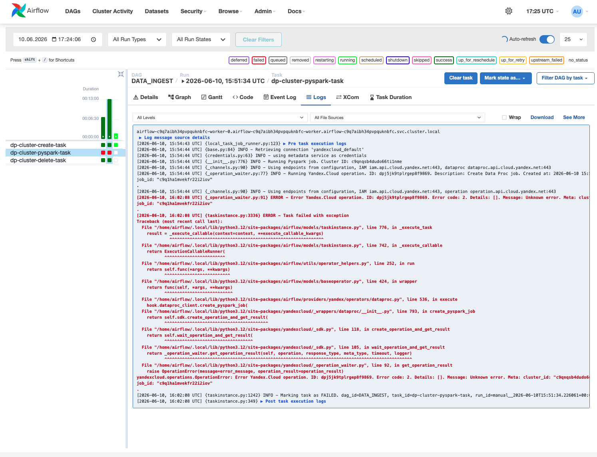

### 2.4 Результат выполнения

Кластер metastore каждый раз падает при запуске без причин. В логах всё зеленое. Ввиду недоступности кластера metastore, получаем ошибку выполнения spark задания(скрин выше):
спарк пытается подключиться к metastore и падает с max tries.

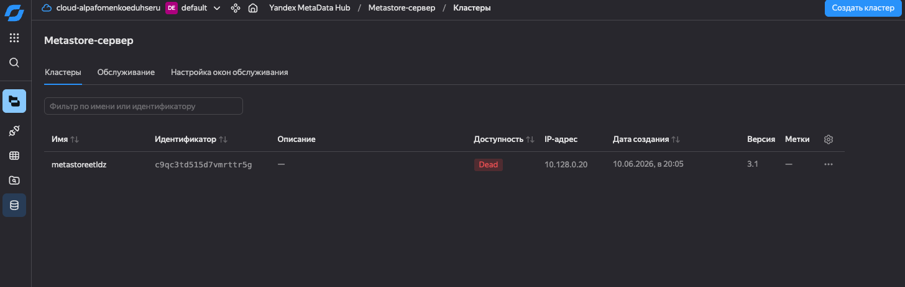

---

## Задание 3. Apache Kafka + PySpark

### 3.1 Архитектура

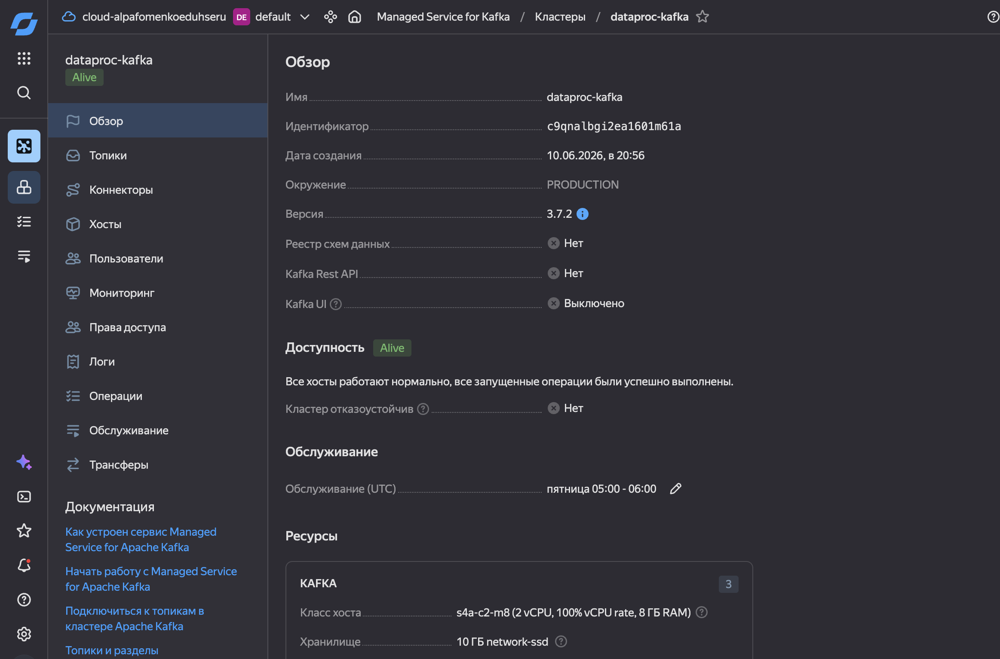

### 3.2 Загрузка в Kafka

```python
#!/usr/bin/env python3
from pyspark.sql import SparkSession
from pyspark.sql import functions as F

BOOTSTRAP = "rc1b-34813ohejg348rd6.mdb.yandexcloud.net:9091"
TOPIC = "dataproc-kafka-topic"
USER = "user1"
PASSWORD = "password1"
SRC = "s3a://dataproc-buck/songs.json"


def main():
    spark = SparkSession.builder.appName("songs-kafka-write-app").getOrCreate()
    raw = (spark.read.option("multiLine", "true").json(SRC))
    if "root" in raw.columns:
        df = raw.select(F.explode(F.col("root")).alias("song"))
    else:
        df = raw.select(F.struct(*raw.columns).alias("song"))
    msgs = df.select(F.to_json(F.col("song")).alias("value"))
    msgs.write.format("kafka")\
        .option("kafka.bootstrap.servers", BOOTSTRAP)\
        .option("topic", TOPIC)\
        .option("kafka.security.protocol", "SASL_SSL")\
        .option("kafka.sasl.mechanism", "SCRAM-SHA-512")\
        .option("kafka.sasl.jaas.config",
                "org.apache.kafka.common.security.scram.ScramLoginModule required "
                f"username={USER}"
                "password={PASSWORD}" 
                ";") \
        .save()

if __name__ == "__main__":
    main()
```


### 3.3 Чтение из топика и разворачивание JSON в плоский вид (пакетная обработка)

```python
#!/usr/bin/env python3
import ast
import json
from pyspark.sql import SparkSession
from pyspark.sql import functions as F
from pyspark.sql.types import (StructType, StructField, StringType,
                               IntegerType, ArrayType)

BOOTSTRAP = "rc1b-34813ohejg348rd6.mdb.yandexcloud.net:9091"
TOPIC = "dataproc-kafka-topic"
USER = "user1"
PASSWORD = "password1"
OUT = "s3a://dataproc-buck/songs-read-batch-output"

SONG_SCHEMA = StructType([
    StructField("Album", StringType()),
    StructField("Album URL", StringType()),
    StructField("Artist", StringType()),
    StructField("Featured Artists", StringType()),
    StructField("Lyrics", StringType()),
    StructField("Media", StringType()),
    StructField("Rank", IntegerType()),
    StructField("Release Date", StringType()),
    StructField("Song Title", StringType()),
    StructField("Song URL", StringType()),
    StructField("Writers", StringType()),
    StructField("Year", IntegerType()),
])
WRITER_SCHEMA = ArrayType(StructType([
    StructField("id", StringType()), StructField("name", StringType()),
    StructField("url", StringType()), StructField("is_verified", StringType())]))
MEDIA_SCHEMA = ArrayType(StructType([
    StructField("provider", StringType()), StructField("type", StringType()),
    StructField("url", StringType()), StructField("native_uri", StringType())]))
 
 
def _py_to_json(s, keys):
    if s is None:
        return None
    try:
        obj = ast.literal_eval(s)
    except (ValueError, SyntaxError):
        return None
    if not isinstance(obj, list):
        return None
    out = [{k: (str(it[k]) if k in it and it[k] is not None else None) for k in keys}
           for it in obj if isinstance(it, dict)]
    return json.dumps(out)
 
 
def main():
    spark = SparkSession.builder.appName("songs-kafka-read-batch-app").getOrCreate()
    writers_udf = F.udf(lambda s: _py_to_json(s, ["id", "name", "url", "is_verified"]), StringType())
    media_udf = F.udf(lambda s: _py_to_json(s, ["provider", "type", "url", "native_uri"]), StringType())
    df = (spark.read.format("kafka")
        .option("kafka.bootstrap.servers", BOOTSTRAP)
        .option("subscribe", TOPIC)
        .option("kafka.security.protocol", "SASL_SSL")
        .option("kafka.sasl.mechanism", "SCRAM-SHA-512")
        .option("kafka.sasl.jaas.config",
                "org.apache.kafka.common.security.scram.ScramLoginModule required "
                f"username={USER} password={PASSWORD} ;")
        .option("startingOffsets", "earliest")
        .load()
        .selectExpr("CAST(value AS STRING)")
        .where(F.col("value").isNotNull()))
    parsed = (df
        .select(F.from_json(F.col("value"), SONG_SCHEMA).alias("s"))
        .where(F.col("s").isNotNull())
        .select(
            F.col("s.Album").alias("album"),
            F.col("s.`Album URL`").alias("album_url"),
            F.col("s.Artist").alias("artist"),
            F.col("s.`Featured Artists`").alias("featured_artists"),
            F.col("s.Lyrics").alias("lyrics"),
            F.col("s.Media").alias("media_raw"),
            F.col("s.Rank").alias("rank"),
            F.col("s.`Release Date`").alias("release_date"),
            F.col("s.`Song Title`").alias("song_title"),
            F.col("s.`Song URL`").alias("song_url"),
            F.col("s.Writers").alias("writers_raw"),
            F.col("s.Year").alias("year"))
        .withColumn("writers_arr", F.from_json(writers_udf(F.col("writers_raw")), WRITER_SCHEMA))
        .withColumn("media_arr", F.from_json(media_udf(F.col("media_raw")), MEDIA_SCHEMA)))
    flat = (parsed
        .withColumn("writer", F.explode_outer(F.col("writers_arr")))
        .withColumn("media", F.explode_outer(F.col("media_arr")))
        .select(
            "album", "album_url", "artist", "song_title", "song_url",
            "rank", "release_date", "year", "featured_artists",
            F.length("lyrics").alias("lyrics_len"),
            F.col("writer.id").alias("writer_id"),
            F.col("writer.name").alias("writer_name"),
            F.col("writer.url").alias("writer_url"),
            F.col("media.provider").alias("media_provider"),
            F.col("media.type").alias("media_type"),
            F.col("media.url").alias("media_url")))
    (flat.write.mode("overwrite")
        .option("header", "true")
        .option("quote", '"')
        .option("escape", '"')
        .option("quoteAll", "true")
        .csv(OUT))
    spark.stop()
 
 
if __name__ == "__main__":
    main()
```

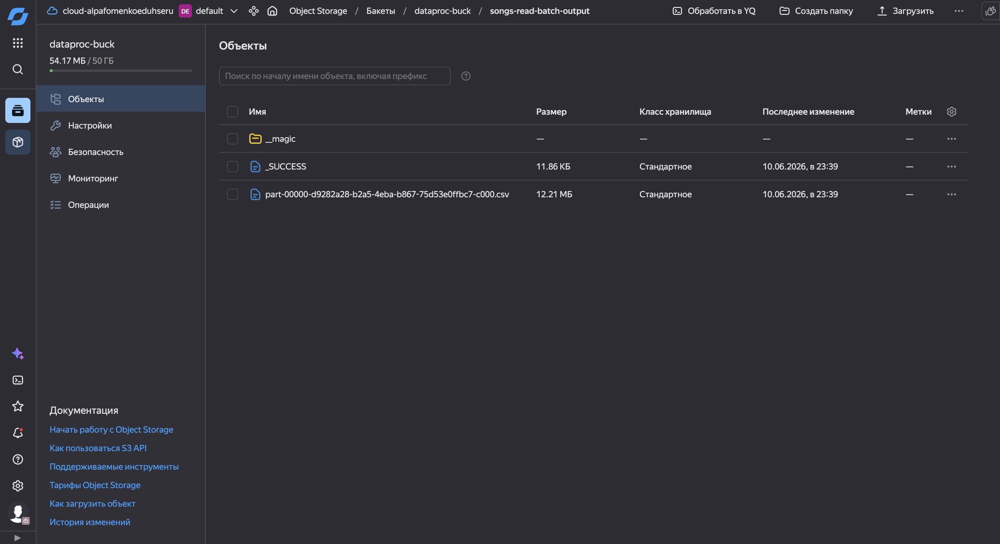

### 3.4 Чтение из топика и разворачивание JSON в плоский вид (потоковая обработка)

```python
#!/usr/bin/env python3
import ast
import json
from pyspark.sql import SparkSession
from pyspark.sql import functions as F
from pyspark.sql.types import (StructType, StructField, StringType,
                               IntegerType, ArrayType)

BOOTSTRAP = "rc1b-34813ohejg348rd6.mdb.yandexcloud.net:9091"
TOPIC = "dataproc-kafka-topic"
USER = "user1"
PASSWORD = "password1"
OUT = "s3a://dataproc-buck/songs-read-stream-output-csv"

SONG_SCHEMA = StructType([
    StructField("Album", StringType()),
    StructField("Album URL", StringType()),
    StructField("Artist", StringType()),
    StructField("Featured Artists", StringType()),
    StructField("Lyrics", StringType()),
    StructField("Media", StringType()),
    StructField("Rank", IntegerType()),
    StructField("Release Date", StringType()),
    StructField("Song Title", StringType()),
    StructField("Song URL", StringType()),
    StructField("Writers", StringType()),
    StructField("Year", IntegerType()),
])
WRITER_SCHEMA = ArrayType(StructType([
    StructField("id", StringType()), StructField("name", StringType()),
    StructField("url", StringType()), StructField("is_verified", StringType())]))
MEDIA_SCHEMA = ArrayType(StructType([
    StructField("provider", StringType()), StructField("type", StringType()),
    StructField("url", StringType()), StructField("native_uri", StringType())]))


def _py_to_json(s, keys):
    if s is None:
        return None
    try:
        obj = ast.literal_eval(s)
    except (ValueError, SyntaxError):
        return None
    if not isinstance(obj, list):
        return None
    out = [{k: (str(it[k]) if k in it and it[k] is not None else None) for k in keys}
           for it in obj if isinstance(it, dict)]
    return json.dumps(out)


def main():
    spark = SparkSession.builder.appName("songs-kafka-read-stream-app").getOrCreate()
    writers_udf = F.udf(lambda s: _py_to_json(s, ["id", "name", "url", "is_verified"]), StringType())
    media_udf = F.udf(lambda s: _py_to_json(s, ["provider", "type", "url", "native_uri"]), StringType())

    query = (spark.readStream.format("kafka")
        .option("kafka.bootstrap.servers", BOOTSTRAP)
        .option("subscribe", TOPIC)
        .option("kafka.security.protocol", "SASL_SSL")
        .option("kafka.sasl.mechanism", "SCRAM-SHA-512")
        .option("kafka.sasl.jaas.config",
                "org.apache.kafka.common.security.scram.ScramLoginModule required "
                f"username={USER} password={PASSWORD} ;")
        .option("startingOffsets", "earliest")
        .load()
        .selectExpr("CAST(value AS STRING)")
        .where(F.col("value").isNotNull())
        .writeStream
        .trigger(once=True)
        .queryName("received_messages")
        .format("memory")
        .start())

    query.awaitTermination()

    raw = spark.sql("select value from received_messages")

    parsed = (raw
        .select(F.from_json(F.col("value"), SONG_SCHEMA).alias("s"))
        .where(F.col("s").isNotNull())
        .select(
            F.col("s.Album").alias("album"),
            F.col("s.`Album URL`").alias("album_url"),
            F.col("s.Artist").alias("artist"),
            F.col("s.`Featured Artists`").alias("featured_artists"),
            F.col("s.Lyrics").alias("lyrics"),
            F.col("s.Media").alias("media_raw"),
            F.col("s.Rank").alias("rank"),
            F.col("s.`Release Date`").alias("release_date"),
            F.col("s.`Song Title`").alias("song_title"),
            F.col("s.`Song URL`").alias("song_url"),
            F.col("s.Writers").alias("writers_raw"),
            F.col("s.Year").alias("year"))
        .withColumn("writers_arr", F.from_json(writers_udf(F.col("writers_raw")), WRITER_SCHEMA))
        .withColumn("media_arr", F.from_json(media_udf(F.col("media_raw")), MEDIA_SCHEMA)))
    flat = (parsed
        .withColumn("writer", F.explode_outer(F.col("writers_arr")))
        .withColumn("media", F.explode_outer(F.col("media_arr")))
        .select(
            "album", "album_url", "artist", "song_title", "song_url",
            "rank", "release_date", "year", "featured_artists",
            F.length("lyrics").alias("lyrics_len"),
            F.col("writer.id").alias("writer_id"),
            F.col("writer.name").alias("writer_name"),
            F.col("writer.url").alias("writer_url"),
            F.col("media.provider").alias("media_provider"),
            F.col("media.type").alias("media_type"),
            F.col("media.url").alias("media_url")))

    (flat.write.mode("overwrite")
        .option("header", "true")
        .option("quote", '"')
        .option("escape", '"')
        .option("quoteAll", "true")
        .csv(OUT))

    spark.stop()


if __name__ == "__main__":
    main()
```

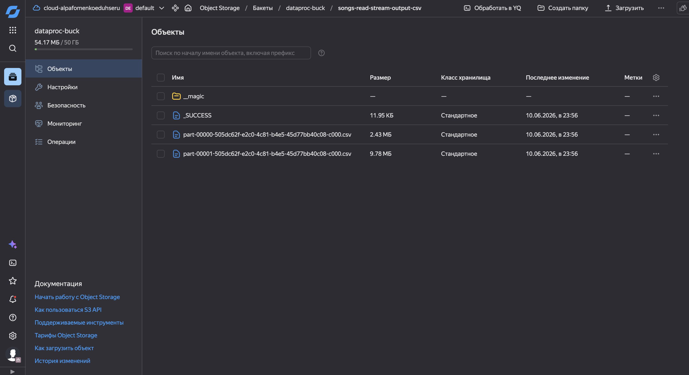

### 3.5 Демонстрация результата
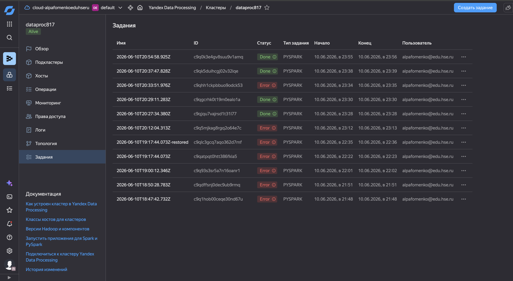
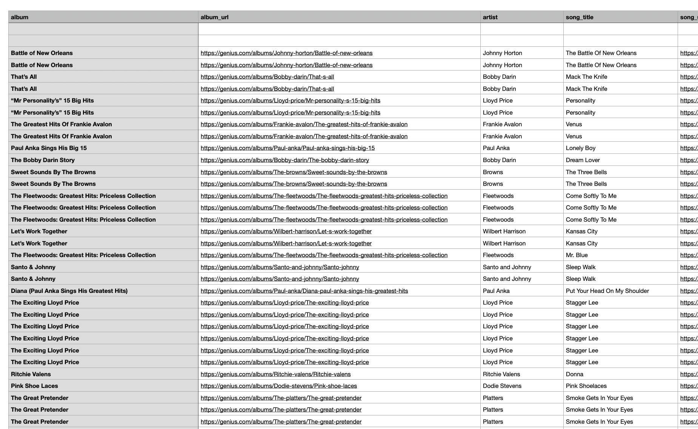

---

## Задание 4. Визуализация в DataLens

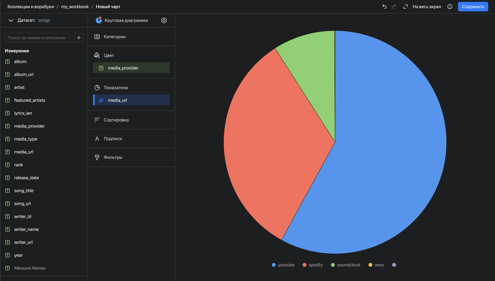

---


